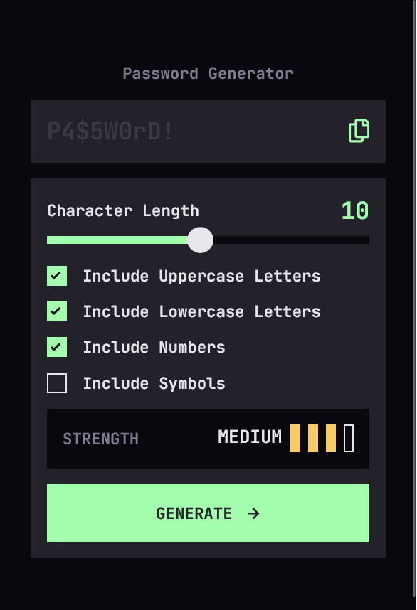

# Frontend Mentor - Password generator app solution

This is a solution to the Password Generator App challenge on Frontend Mentor.

## Table of contents
- [Overview](#overview)
  - [The challenge](#the-challenge)
  - [Screenshot](#screenshot)
  - [Links](#links)
- [My process](#my-process)
  - [Built with](#built-with)
  - [What I learned](#what-i-learned)
  - [Continued development](#continued-development)
  - [Useful resources](#useful-resources)
  - [AI Collaboration](#ai-collaboration)
- [Author](#author)


## Overview

### The challenge

Users should be able to:
- Generate a password based on selected character options.
- Adjust password length via a custom range slider.
- Copy the generated password to the clipboard.
- See a strength rating based on a weighted logic matrix.
- View an optimal layout across different screen sizes.

### Screenshot



### Links

- Solution URL: [Add your solution URL here]
- Live Site URL: [https://password-generator-app-frontendment.vercel.app/]

---

## My process

### Built with

- Semantic HTML5
- Tailwind CSS v4 (custom theme & utilities)
- Mobile-first workflow
- React (component-based architecture)
- TypeScript (strict typing)
- Vitest & React Testing Library (unit + integration testing)
- Figma (design reference)

---

### What I learned

#### 1. Styling complex native form elements

Customizing sliders and checkboxes required browser-specific solutions.

- **Range slider:** Implemented cross-browser styling using vendor pseudo-elements and a dynamic `linear-gradient` for the active track.
- **Custom checkbox:** Rebuilt using `appearance: none` while preserving accessibility and keyboard navigation.
- **SVG icons:** Replaced `` tags with SVG components using `currentColor` to enable Tailwind-driven color transitions.

#### 2. Modeling state as a single source of truth

Instead of multiple `useState` hooks, I modeled all generator options in a single `settings` object.  
This simplified data flow and enabled generic input handlers using computed keys.

#### 3. Data-driven testing & browser API mocking

This project deepened my experience with automated testing:

- **Matrix testing:** Used `it.each` to validate 16+ strength combinations in a compact format.
- **Integration testing:** Verified real user flows with React Testing Library.
- **Mocking browser APIs:** Since JSDOM doesn't support the Clipboard API, I learned how to mock `navigator.clipboard` using `Object.defineProperty`:

```typescript
Object.defineProperty(navigator, 'clipboard', {
  value: { writeText: vi.fn().mockImplementation(() => Promise.resolve()) },
  configurable: true,
});
```

---

### Continued development

Areas I want to improve next:

- Writing logic tests earlier (moving toward TDD)
- Exploring `useReducer` for more complex state scenarios
- Improving accessibility with better screen reader feedback

---

### Useful resources

- [MDN – Styling range inputs](https://developer.mozilla.org/en-US/docs/Web/HTML/Reference/Elements/input/range) 
- [Vitest documentation](https://vitest.dev/guide/)

---

### AI Collaboration

AI was used as a technical discussion partner rather than a code generator.  
The focus was on architectural decisions, debugging strategies, and testing approaches.

---

## Author

Frontend Mentor – [@Stefan](https://www.frontendmentor.io/profile/stefanteichert)
